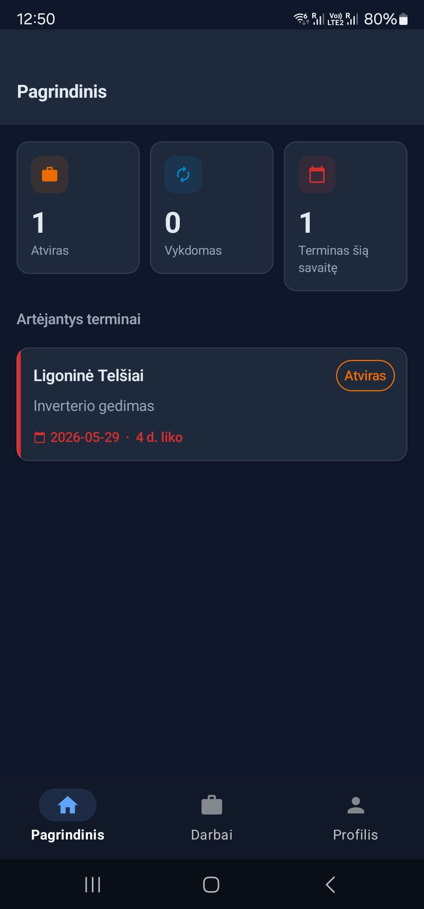
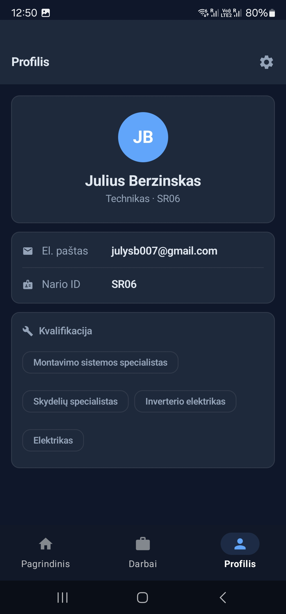
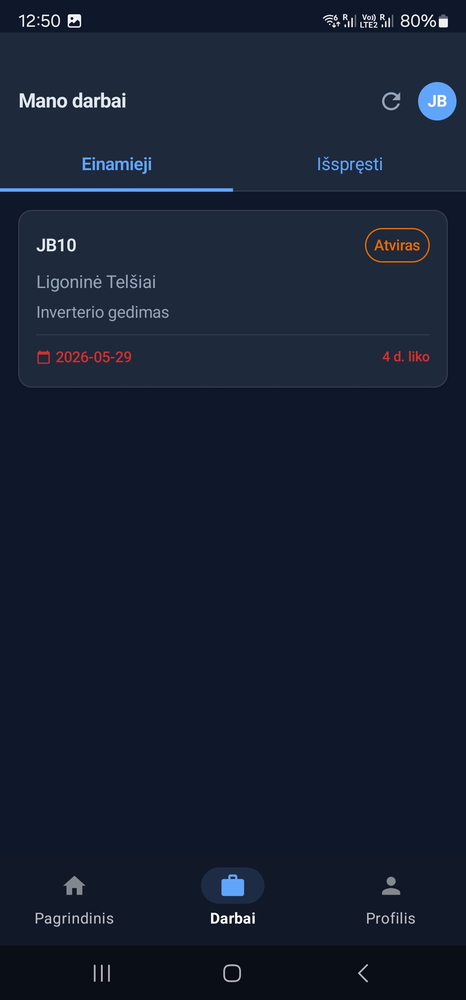
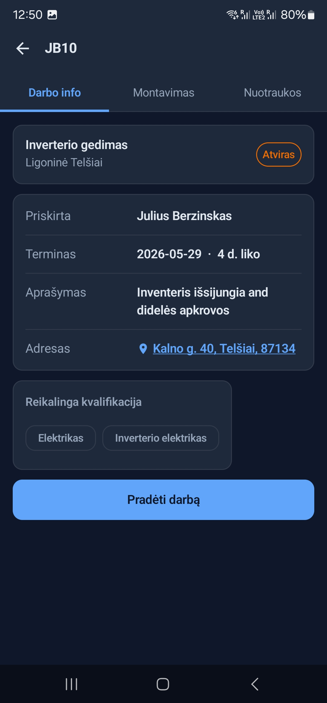
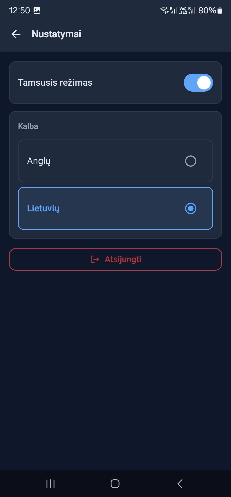

# SolarRadar — Android

The field technician app for SolarRadar, a maintenance and fault-registration system for solar power plants, built for a Lithuanian solar O&M company.

This repository contains the Android app. The companion web administration panel lives at SolarRadar-Web.

Built as my bachelor's thesis at Vilnius Business College (Programming and Internet Technologies), 2026.

# What this app is for

A technician arrives at a solar plant with a fault to fix. Before this system existed, that meant a phone call to find out what the job was, a paper note, and photos sent afterwards through a messaging app — where they were promptly lost.

This app replaces that. The technician opens their phone, sees the jobs assigned to them, navigates to the site, does the work, and submits a report with photos before leaving. The admin sees each status change within seconds.

It is deliberately small. A technician on a roof in the rain needs three taps, not a menu tree.

# What it does

Sign in — email and password through Firebase Authentication. The session persists between launches, so there is no login screen every morning. Access is checked against the role field on the user's Firestore document: only technician accounts reach the app.

Assigned jobs — the home screen lists jobs where assignedTo matches the signed-in technician's UID. Nobody else's work is visible. Each job is a card with title, site and a colour-coded priority chip. The list uses Firestore's onSnapshot listener, so a newly assigned job appears without pulling to refresh.

Job detail — full description, site data and address. Status moves in one direction: Open → In Progress → Resolved. The change writes straight to Firestore and the admin panel reflects it in seconds.

Site location — the site plotted on an OpenStreetMap view, with a handoff to the device's navigation app for directions.

Report submission — after the work is done: pick an outcome, write notes, attach photos from the camera or gallery. Images upload to Firebase Storage under reports/{reportId}/photos/. The report appears in the admin panel immediately.

Tech stack
Layer	Choice
Language	Kotlin
UI	Jetpack Compose
Auth	Firebase Authentication (email + password)
Database	Cloud Firestore (real-time)
Files	Firebase Storage
Maps	OpenStreetMap Android SDK
IDE	Android Studio
Why this stack

Kotlin over Java: null safety matters in an app that spends its life handling optional Firestore fields, and coroutines make the asynchronous work readable rather than nested. It has also been Google's recommended Android language since 2019.

Jetpack Compose over XML layouts: the UI recomposes when state changes, so there is no manual View lifecycle handling. With real-time Firestore data arriving continuously, that is the difference between a screen that updates itself and one full of refresh logic.

No custom backend. The app connects to the same Firebase project as the web panel — same auth, same database, same storage. Two clients, one shared infrastructure, no REST API layer in between.

# Architecture
┌──────────────────┐         ┌──────────────────┐
│   Android app    │         │    Web admin     │
│ Kotlin + Compose │         │ React 19 + Vite  │
│  (this repo)     │         │                  │
└────────┬─────────┘         └────────┬─────────┘
         │                            │
         └──────────┬─────────────────┘
                    │
         ┌──────────▼──────────┐
         │      Firebase       │
         │  Authentication     │
         │  Cloud Firestore    │
         │  Storage            │
         │  Cloud Functions    │
         └─────────────────────┘

The app reads from two collections and writes to two:

Collection	App's use
users	Reads own document to confirm the technician role
jobs	Reads jobs where assignedTo == own UID; writes status
reports	Writes a report on job completion
Storage	Uploads report photos

Firestore security rules — not just app-side filtering — enforce that a technician can only read their own assigned jobs.

## Screenshots

  
  
  
  
  
  

Requirements: Android Studio, JDK 17, a Firebase project with Authentication, Firestore and Storage enabled.

bash
git clone https://github.com/juliusberzinskas/SolarRadar-Android.git
Open the project in Android Studio and let Gradle sync.
In the Firebase console, register an Android app and download google-services.json.
Place it in the app/ directory. It is gitignored and not included in this repository.
Build and run on an emulator or a physical device.

The app must point at the same Firebase project as the web panel, or the two halves will not see each other's data.

Device requirements
Android 8.0 (API level 26) or newer
2 GB RAM minimum
100 MB free storage
Camera, for report photos
Internet connection (4G/LTE or Wi-Fi recommended)
Distribution

The app is distributed as an APK through the company's internal channel rather than Google Play. Installing requires enabling installation from unknown sources on the device.

# Testing

Manual black-box testing, run as part of the system's 19 test cases across four modules: authentication and role management, the admin panel, real-time synchronisation, and this app.

Tested on an Android 13 emulator and a physical Samsung Galaxy S23 Ultra, against a Firebase Blaze project with Firestore in europe-west.

All cases passed. Three minor non-functional defects were found and fixed during testing.

Roadmap

This version covers the core technician workflow. Planned next:

Offline mode — solar farms are rarely near good coverage, and this is the most requested addition
Work-hour logging
Shift calendar
Push notifications on job assignment, through Cloud Functions
Note on data

This repository contains no client data and no Firebase credentials. The system was developed and demonstrated using generated test data only — the company's internal records were never used in the project.

Related
SolarRadar-Web — the administration panel

# Author
Julius Beržinskas

Eight years in solar construction in Sweden — installation, site supervision and quality inspection — before building this. The subject was not chosen at random: I spent years on the other side of it, logging faults and watching information get lost between the site and the office.
